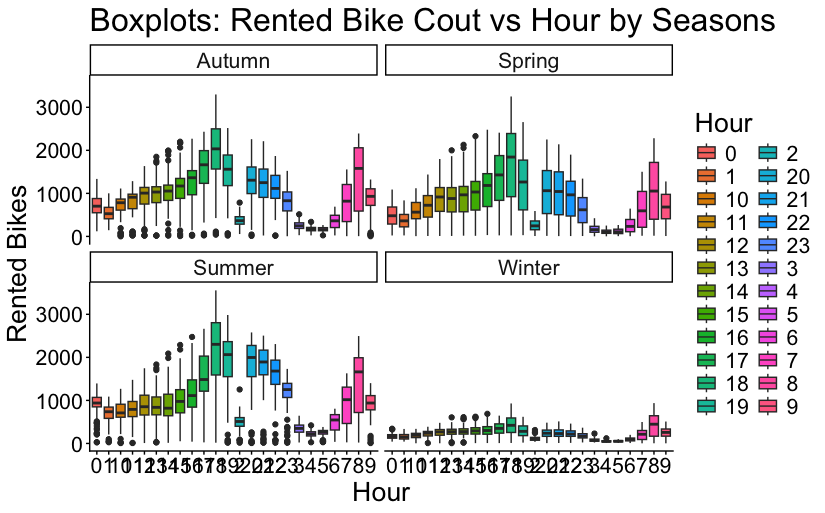
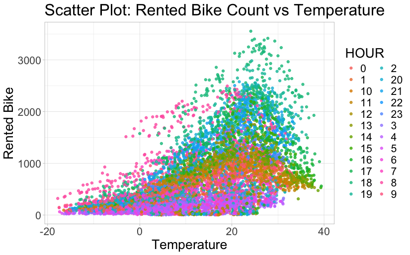
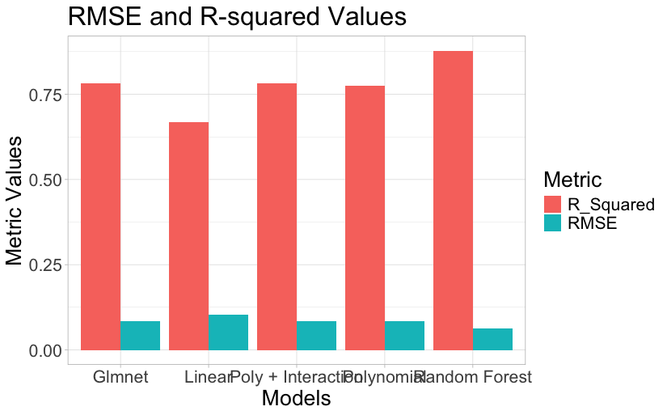

# Data Science Capstone Project: Advanced Analytics with R (Bike-Sharing Demand Analysis)

### Problem Overview

An AI-powered weather data analytics company requires a data scientist to extract, analyse, and communicate data insight to understand how weather affects bike-sharing demand in urban areas in real time.

### Objective

The objective of this analysis was:

- Collect and understand data from multiple sources
- Perform data wrangling and preparation with regular expressions and Tidyverse
- Perform exploratory data analysis with SQL and visualisation using Tidyverse and ggplot2
- Perform modelling of the data with linear regressions using Tidymodels
- Present a report to stakeholders

### About Datasets

A summary of the data required for the analysis includes:

- **Seoul Bike Sharing Demand Data Set**: contains weather information (Temperature, Humidity, Windspeed, Visibility, Dewpoint, Solar radiation, Snowfall, Rainfall) and the number of bikes rented per hour and date.
- **Open Weather API Data Set**: current and forecasted weather data for any location, including over 200,000 cities, collected and processed from global and local weather models, satellites, radars, and a network of weather stations.
- **Global Bike Sharing Systems Data Set**: an HTML table from Wikipedia listing active bicycle-sharing systems around the world.
- **World Cities Data**: names, latitudes, and longitudes for major cities around the world.

### Summary of Notebook

#### Data Preprocessing

I started with data collection, scraping global bike-sharing system information and gathering weather data via API. Then I carried out extensive data wrangling by standardising column names and preprocessing the datasets. I addressed missing values in the Seoul bike-sharing dataset before applying feature engineering techniques like dummy encoding and min-max scaling to prepare the data for predictive modelling.

#### Exploratory Data Analysis

Exploratory Data Analysis (EDA) uncovered the following insights:

- The dataset covered one year of data.
- No record and day had zero bike rentals.
- There were clear seasonal trends, with summer having the most records.
- Temperature has a significant influence on bike rentals because of its wide range.
- Precipitation was rare, only happening in the fourth quartiles for rain and snowfall.
- The average windspeed is very light at 1.7 m/s, and even the maximum is a moderate breeze.

**Demand by hour and season** — rentals peak sharply around commuting hours in spring, summer, and autumn, and collapse almost entirely in winter:

**Temperature vs. demand** — a clear positive relationship, with rentals climbing steadily as temperature rises before tapering at the extremes:

#### Predictive Modelling

I started the predictive modelling with baseline linear regressions. The model using all predictor variables outperformed the model using weather-only predictor variables, explaining 66% of the variance compared to 43% for the weather-only predictors.

I refined the approach to improve predictive accuracy (R-squared) and reduce average predictive error (RMSE) by:

- Adding polynomial terms, which increased predictive accuracy by 11%.
- Adding interaction terms and introducing regularisation with glmnet, improving the model further by 1%.

I went a step further and implemented a non-linear predictive model (Random Forest), achieving 88% predictive accuracy and a 6% average prediction error — an 11% accuracy improvement and 2% error reduction over the best-performing linear model.

#### Conclusion and Recommendation

From this analysis, I identified key factors influencing bike rentals, including temperature, seasonal variation, and time of day. Recommendations to improve the analysis and predictive modelling further:

- Manage outliers and multicollinearity to improve the performance of linear models
- Collect additional data to improve model performance
- Perform time series analysis to better capture trends and seasonality in the data
- Explore advanced feature engineering techniques like lag features or moving averages

#### Dependencies

- R version 4.3.1
- rvest version: 1.0.4
- httr version: 1.4.7
- ggplot2 version: 3.5.1
- repr version: 1.1.7
- rlang version: 1.1.4
- tidymodels version: 1.2.0
- stringr version: 1.5.1
- glmnet version: 4.1.8
- caret version: 6.0.94
- randomForest version: 4.7.1.1
